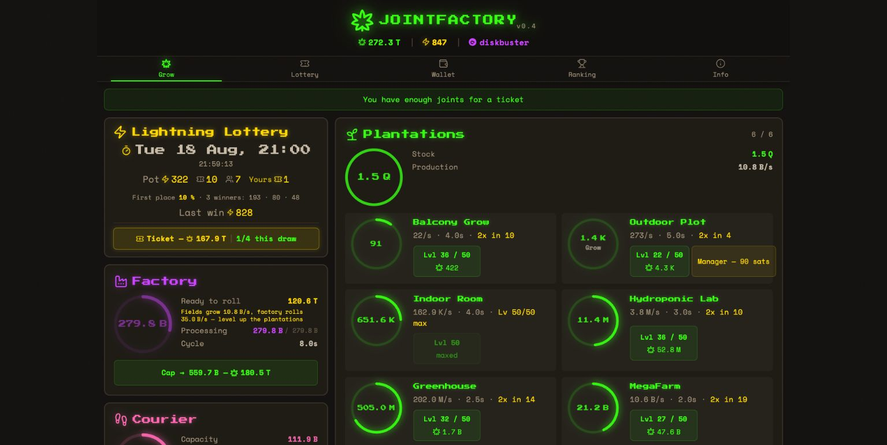

# Joint Factory



A Bitcoin-native idle game built around short, comparable rounds.

Grow a production chain from plantation through courier to factory. A round ends
at one quadrillion joints; finishing banks one prestige star and resets the chain
for the next race. Managers automate production, boosts accelerate it, and joints
buy entries for the Lightning lottery.

Login uses Nostr—no email or password. Play at
[jointfactory.io](https://jointfactory.io).

## Game concept

Production is a chain, not a sum. Plantations grow the crop, the courier moves it
and the factory turns it into joints. The slowest station limits the whole chain,
so progress comes from keeping all three stages in balance instead of upgrading
only one of them.

Each round follows the same loop:

1. Start with a small manual chain and reinvest joints in plots, levels and
   transport or factory capacity.
2. Hire managers to automate the three stations. The first three managers are
   free; further automation costs sats.
3. Spend joints on permanent speed steps for the current round, or sats on timed
   boosts. Sats spent on managers and boosts fund the lottery pot.
4. Once the chain is automated and the player has contributed sats to the pot,
   joints can buy up to four lottery tickets per draw. Ticket prices scale with
   the player's own production rate.
5. Reach one quadrillion joints, record the round time and reset the production
   chain. The completed round awards one prestige star and the next race begins.

Later rounds make managers cheaper and progressively automate the early plots for
free, while every production race still starts from the same basic chain. The
leaderboards compare completed rounds, finish times and prestige.

Lottery draws run Tuesday, Thursday and Saturday at 21:00 Berlin time. Deposits,
winnings and withdrawals use Lightning; the game itself never creates sats.

## Install

Requires Node.js and an LNbits instance.

```bash
npm install
cp .env.example .env
npm run build
npm run dev:server
```

For local development, set `JF_NOSTR_OFFLINE=1` in `.env`, then run `npm run dev`
in a second terminal. The frontend is served on port 5173 and proxies the API and
WebSocket to port 3421.

Production uses the included PM2 configuration. The SQLite schema is created and
extended automatically when the server starts; keep `data/` outside Git and back
it up before deployment.

## Stack

React, TypeScript, Vite, Fastify, SQLite, Nostr and LNbits.

## License

Private—All rights reserved.
